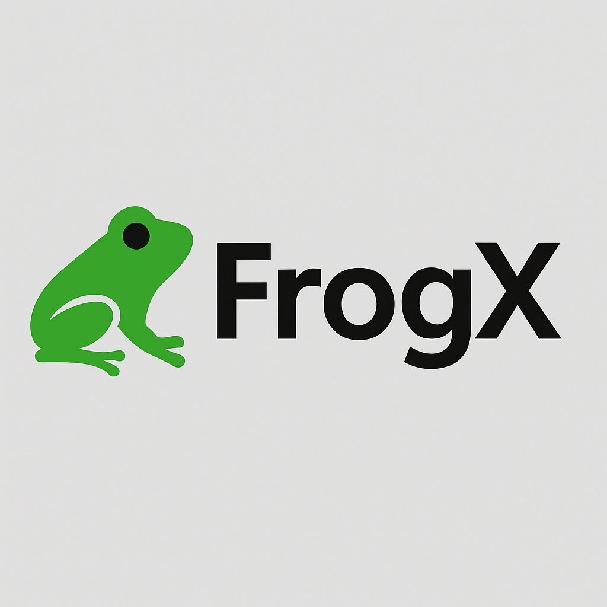

# 🐸 **FrogX — nano, but not stupid**

<div align="center">
  
</div>

<p align="center">
  <b>A minimal terminal text editor that refuses to be dumb.</b><br>
  Clean. Fast. C++23. No bloat. No colors. No bullshit.<br>
</p>

---

## 🚀 **Features**

* ✨ **C++23** modern codebase (fast, clean, zero legacy noise)
* 🐸 **Ctrl+A — Select All** (nano never had the courage)
* 💾 **Ctrl+O — Save with filename prompt** (nano-style)
* ✂️ **Ctrl+K / Ctrl+U — Cut / Uncut line**
* 🔍 **Ctrl+W — Forward search**
* 📌 **Status bar + help bar**, nano-like but improved
* 📦 **Right-click paste** (because terminals can do that)
* 🧼 No syntax highlight, no color spam — **pure editing**
* 🗂️ Loads non-existent files as empty buffer
* 🔥 ASCII splash screen of FrogX at startup
* 🌐 Works globally:

  ```bash
  sudo cp frogx /usr/local/bin/
  frogx file.cpp
  ```

---

## 📥 **Download**

🔗 **Latest Release (v1.0):**
👉 [https://github.com/victormeloasm/frogx/releases/download/1.0/frogx.zip](https://github.com/victormeloasm/frogx/releases/download/1.0/frogx.zip)

Unzip and place the executable wherever you like.

---

## 🔧 **Build From Source**

### **Requirements**

* `clang++` or `g++` with C++23
* `ncurses` development package
* `lld` recommended for fast linking

### **Compile**

```bash
clang++ -std=c++23 -O3 -flto=thin -fuse-ld=lld -lncurses -o frogx frogx.cpp
```

### **Install globally**

```bash
sudo mv frogx /usr/local/bin/
sudo chmod 755 /usr/local/bin/frogx
```

---

## 🧠 **Keyboard Shortcuts**

| Shortcut            | Action                         |
| ------------------- | ------------------------------ |
| **Ctrl+X**          | Exit (double press if unsaved) |
| **Ctrl+O**          | Save (prompt for filename)     |
| **Ctrl+A**          | Select all                     |
| **Del / Backspace** | Delete / Backspace             |
| **Ctrl+K**          | Cut line                       |
| **Ctrl+U**          | Uncut (paste)                  |
| **Ctrl+W**          | Search forward                 |
| **Arrow Keys**      | Move cursor                    |
| **Home / End**      | Line begin / end               |
| **Page Up / Down**  | Scroll by screen               |
| **Right-Click**     | Paste                          |

---

## 📝 **Changelog (v1.0.0)**

* First public release
* Modern C++23 rewrite
* Full ncurses UI
* New shortcuts (Ctrl+A, etc.)
* Better save prompt
* Status/help bars
* ASCII splash
* Global install support

---

## 🐸 **Why FrogX?**

Because sometimes all you want is:

* no plugins
* no 200-line config files
* no LSP
* no AI
* no delay

Just open a file → type → save → close.
**FrogX does exactly that. Nothing more. Nothing less.**

---

## 🐸💚 **Part of the FrogTools ecosystem**

Security. Cryptography. Compression. Editors.
Tudo do Porquinho. Tudo open source. Tudo Frog.


